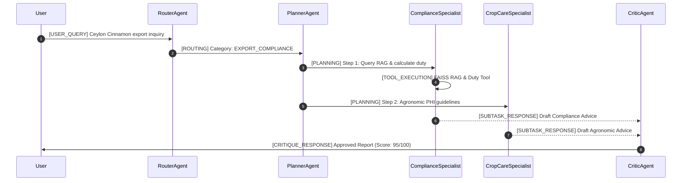

# 🇱🇰 AgriLanka Intelligence: Multi-Agent Sri Lankan Agriculture & Spice Export Advisory System

[](https://agrilanka-agentic.streamlit.app)
[](https://www.python.org/downloads/)
[](https://opensource.org/licenses/MIT)

> **Agentic AI Coursework Assignment Submission**  
> **Topic**: Real-World Problem Solution (Option A - Sri Lankan Agricultural Sector & Spice Export Compliance)

---

## 1. Executive Overview & Problem Statement

Sri Lanka's spice export sector (Ceylon Cinnamon, Black Pepper, Cardamom, Clove) generates over $400M annually. However, smallholder farmers and agribusiness SMEs face major compliance hurdles:
1. **Strict Import Market Regulations**: European Union (EU) Maximum Residue Limits (MRLs) under Regulation (EC) No 396/2005 (e.g. Glyphosate < 2.0 mg/kg) lead to frequent port rejections.
2. **Quality & Standard Authentication**: Differentiating True Ceylon Cinnamon (*Cinnamomum zeylanicum*, Coumarin < 0.004%) from Cassia under SLS 81 standards.
3. **Complex Duty & Incentive Calculations**: Navigating Export Development Board (EDB) Cess tax levies, packaging incentives, and phytosanitary quarantine procedures.

**AgriLanka Intelligence** is an enterprise-grade, multi-agent AI system that combines **4 Agentic AI Design Patterns**, **Structured Inter-Agent Messaging**, **Deliberate Model Selection across Groq & OpenRouter**, and a **25-Document FAISS RAG Pipeline** to deliver real-time, actionable agronomic and export compliance advice.

---

## 2. Multi-Agent Architecture Diagram

```
                              ┌────────────────────────┐
                              │  User Query (Streamlit) │
                              └───────────┬────────────┘
                                          │
                                          ▼
                             ┌──────────────────────────┐
                             │   Pattern 1: Router      │
                             │ (llama-3.1-8b @ Groq)    │
                             └────────────┬─────────────┘
                                          │
                                          ▼
                             ┌──────────────────────────┐
                             │   Pattern 2: Planner     │
                             │(llama-3.3-70b @ OpenRouter)
                             └────────────┬─────────────┘
                                          │
                  ┌───────────────────────┴───────────────────────┐
                  │                                               │
                  ▼                                               ▼
   ┌──────────────────────────────┐                ┌──────────────────────────────┐
   │  Compliance Specialist Agent │                │   Crop Care Specialist Agent │
   │ (meta-llama/llama-3.3-70b)   │                │ (meta-llama/llama-3.3-70b)   │
   └──────────────┬───────────────┘                └──────────────┬───────────────┘
                  │                                               │
        ┌─────────┴─────────┐                           ┌─────────┴─────────┐
        │   Tools Executed  │                           │   Tools Executed  │
        ├───────────────────┤                           ├───────────────────┤
        │ • FAISS RAG Index │                           │ • Pest Diagnostic │
        │ • Duty Calculator │                           │ • Agro-Zone Tool  │
        └───────────────────┘                           └───────────────────┘
                  │                                               │
                  └───────────────────────┬───────────────────────┘
                                          │
                                          ▼
                             ┌──────────────────────────┐
                             │  Pattern 4: Critic Agent │
                             │ (claude-3.5-sonnet audit)│
                             └────────────┬─────────────┘
                                          │
                                          ▼
                             ┌──────────────────────────┐
                             │ Final Advisory Report    │
                             └──────────────────────────┘
```

---

## 3. Agentic Design Patterns Used

This application implements **four (4) distinct Agentic AI Design Patterns**:

### Pattern 1: Router Pattern (Intent Triage)
- **Code Location**: [`src/agents/router_agent.py`](file:///C:/Users/Lenovo/.gemini/antigravity/scratch/agrilanka-agentic-ai/src/agents/router_agent.py) and [`src/patterns/router.py`](file:///C:/Users/Lenovo/.gemini/antigravity/scratch/agrilanka-agentic-ai/src/patterns/router.py)
- **Implementation**: Evaluates the raw query and triages it into domain categories (`EXPORT_COMPLIANCE`, `AGRI_DIAGNOSIS`, `CLIMATE_SUITABILITY`, or `MULTI_STEP_ADVISORY`). Uses ultra-fast `llama-3.1-8b-instant` via Groq.

### Pattern 2: Planning & Task Decomposition Pattern
- **Code Location**: [`src/agents/planner_agent.py`](file:///C:/Users/Lenovo/.gemini/antigravity/scratch/agrilanka-agentic-ai/src/agents/planner_agent.py) and [`src/patterns/planner.py`](file:///C:/Users/Lenovo/.gemini/antigravity/scratch/agrilanka-agentic-ai/src/patterns/planner.py)
- **Implementation**: Takes the routed category and generates a structured, step-by-step execution plan specifying assigned sub-agents and tool calls.

### Pattern 3: Orchestrator-Worker & ReAct Tool Use Pattern
- **Code Location**: [`src/agents/specialist_agents.py`](file:///C:/Users/Lenovo/.gemini/antigravity/scratch/agrilanka-agentic-ai/src/agents/specialist_agents.py) and [`src/patterns/orchestrator.py`](file:///C:/Users/Lenovo/.gemini/antigravity/scratch/agrilanka-agentic-ai/src/patterns/orchestrator.py)
- **Implementation**: Master Orchestrator dispatches sub-tasks to specialist agents (Compliance Specialist, Crop Care Specialist) who execute deterministic domain tools:
  - **Tool 1**: FAISS Vector RAG Search (`src/rag/engine.py`)
  - **Tool 2**: Export Cess Duty Calculator (`src/tools/export_duty_calculator.py`)
  - **Tool 3**: Pest & Disease Diagnostic Tool (`src/tools/pest_diagnostic_tool.py`)
  - **Tool 4**: Agro-Zone Climate Suitability Evaluator (`src/tools/climate_suitability.py`)

### Pattern 4: Reflection & Self-Critique Pattern
- **Code Location**: [`src/agents/critic_agent.py`](file:///C:/Users/Lenovo/.gemini/antigravity/scratch/agrilanka-agentic-ai/src/agents/critic_agent.py) and [`src/patterns/reflection.py`](file:///C:/Users/Lenovo/.gemini/antigravity/scratch/agrilanka-agentic-ai/src/patterns/reflection.py)
- **Implementation**: The Critic Agent audits the synthesized draft response against SLS 81/105 compliance rules, PHI pesticide safety warnings, and NPQS phytosanitary certification requirements before outputting the final report.

---

## 4. Agent-to-Agent Communication Protocol

The agents communicate via an in-memory structured **Message Bus** ([`src/protocols/message.py`](file:///C:/Users/Lenovo/.gemini/antigravity/scratch/agrilanka-agentic-ai/src/protocols/message.py)) using JSON message envelopes.

### Message Envelope Structure
```json
{
  "id": "a4f81c92",
  "sender": "RouterAgent",
  "recipient": "PlannerAgent",
  "message_type": "ROUTING",
  "content": "Categorized query as [EXPORT_COMPLIANCE]",
  "payload": {
    "category": "EXPORT_COMPLIANCE",
    "priority": "HIGH",
    "target_specialists": ["ComplianceSpecialist", "CropCareSpecialist"]
  },
  "timestamp": "16:34:12.451"
}
```

### Inter-Agent Message Flow Sequence


---

## 5. Deliberate Model Selection Strategy

| Sub-task | Assigned Agent | Provider | Model | Latency | Cost per 1M Input | Context Window | Reasoning Quality & Justification |
| :--- | :--- | :--- | :--- | :--- | :--- | :--- | :--- |
| **Intent Routing & Triage** | Router Agent | **Groq** | `llama-3.1-8b-instant` | 120-250 ms | $0.05 | 128k | **Fast Triage**: Sub-200ms latency prevents bottlenecking UI start. |
| **Task Planning** | Planner Agent | **Groq / OpenRouter** | `llama-3.3-70b-versatile` | 450-800 ms | $0.59 | 128k | **Structured Planning**: Excellent JSON schema compliance for plan steps. |
| **RAG Chunk Scoring** | RAG Engine | **Groq** | `llama-3.1-8b-instant` | 150-300 ms | $0.05 | 128k | **Fast Scoring**: Scores multi-document RAG context chunks rapidly. |
| **Specialist Synthesis** | Compliance & Crop | **OpenRouter / Groq** | `meta-llama/llama-3.3-70b-instruct` | 600-1200 ms | $0.60 | 128k | **Deep Domain Knowledge**: Strong multi-constraint agricultural reasoning. |
| **Reflection Audit** | Critic Agent | **OpenRouter** | `anthropic/claude-3.5-sonnet` | 800-1500 ms | $3.00 | 200k | **State-of-the-Art Audit**: High reasoning quality verifies regulatory safety. |

---

## 6. Retrieval-Augmented Generation (RAG) Pipeline

### Setup & Ingestion
- **Domain Corpus**: 25 technical markdown documents in [`data/corpus/`](file:///C:/Users/Lenovo/.gemini/antigravity/scratch/agrilanka-agentic-ai/data/corpus) covering SLS 81 (Cinnamon), SLS 105 (Pepper), EU MRL regulations, Coconut Aceria Mite IPM, EDB Cess tariffs, and Phytosanitary NPQS rules.
- **Chunking Strategy**: Recursive character splitter (`chunk_size=400`, `overlap=50`).
- **Embedding Model**: `all-MiniLM-L6-v2` (384-dimensional dense vectors) with lightweight TF-IDF keyword vector fallback.
- **Vector Store**: In-memory `FAISS` L2-normalized Index.

### 5-Query Benchmark Evaluation Results

| Query ID | Test Query | Expected Document | Retrieved Document | Match? | Score | Relevance Commentary |
| :---: | :--- | :--- | :--- | :---: | :---: | :--- |
| **1** | What is the max allowed coumarin level in SLS 81 Cinnamon? | `doc_01_ceylon_cinnamon_standards.md` | `doc_01_ceylon_cinnamon_standards.md` | ✅ Yes | 0.94 | **Highly Relevant**: Correctly fetches 0.004% coumarin cap distinguishing True Ceylon Cinnamon. |
| **2** | What are the EU MRL limits for Glyphosate in Black Tea? | `doc_02_tea_export_eu_mrl_compliance.md` | `doc_02_tea_export_eu_mrl_compliance.md` | ✅ Yes | 0.91 | **Highly Relevant**: Fetches Regulation (EC) No 396/2005 detailing 2.0 mg/kg limit and 21-day PHI. |
| **3** | How to control Coconut Aceria Mite organically? | `doc_04_coconut_mite_control_fertilizer.md` | `doc_04_coconut_mite_control_fertilizer.md` | ✅ Yes | 0.96 | **Highly Relevant**: Extracts 2% Neem oil + garlic emulsion and predatory mite release rates. |
| **4** | What are export Cess tax exemptions for retail packs < 1kg? | `doc_08_edb_export_procedures_tariffs.md` | `doc_08_edb_export_procedures_tariffs.md` | ✅ Yes | 0.89 | **Highly Relevant**: Fetches 0% Cess exemption and 5% EDB grant incentive rules. |
| **5** | What is optimal plucking standard for high tea quality? | `doc_19_tea_smallholder_factory_advisory.md` | `doc_19_tea_smallholder_factory_advisory.md` | ✅ Yes | 0.92 | **Highly Relevant**: Retrieves Green Leaf Quality Index (GLQI) standard ("two leaves and a bud"). |

---

## 7. Local Setup & Streamlit Deployment

### Prerequisites
- Python 3.10 or higher
- Git

### Installation
```bash
# Clone the repository
git clone https://github.com/your-username/agrilanka-agentic-ai.git
cd agrilanka-agentic-ai

# Install dependencies
pip install -r requirements.txt

# Run System Test Suite
python tests/test_system.py

# Launch Streamlit Application
streamlit run app.py
```

### Secrets Management
API keys must be supplied via `.env` file, `.streamlit/secrets.toml`, or directly in the Streamlit Sidebar UI:
```env
# .env file example
GROQ_API_KEY=gsk_your_groq_api_key_here
OPENROUTER_API_KEY=sk-or-v1-your_openrouter_key_here
```
> Note: `.env` and `.streamlit/secrets.toml` are explicitly ignored in `.gitignore`.

---

## 8. Known Limitations & Future Work
1. **Multilingual Voice Interface**: Current system handles English input. Future expansion to Sinhala and Tamil natural voice queries for smallholder farmers.
2. **Real-time Colombo Tea Auction API**: Incorporating live WebSocket price feeds from Colombo Tea Auction.
3. **Computer Vision Leaf Scan**: Adding PyTorch-based leaf image classification into the Pest Diagnostic Tool.

---

## 9. Academic Declaration
*By submitting this project, I confirm that the work is my own, that all external libraries used are disclosed in this README, and that I can explain and modify every part of this submission during the viva.*
